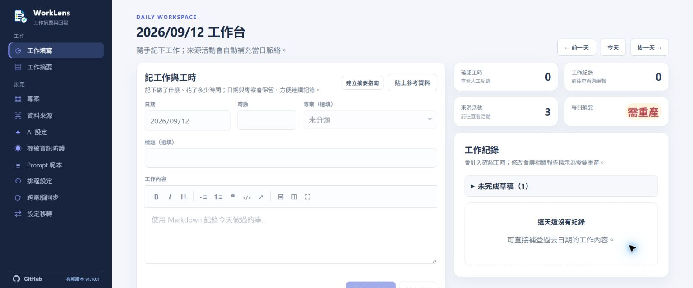
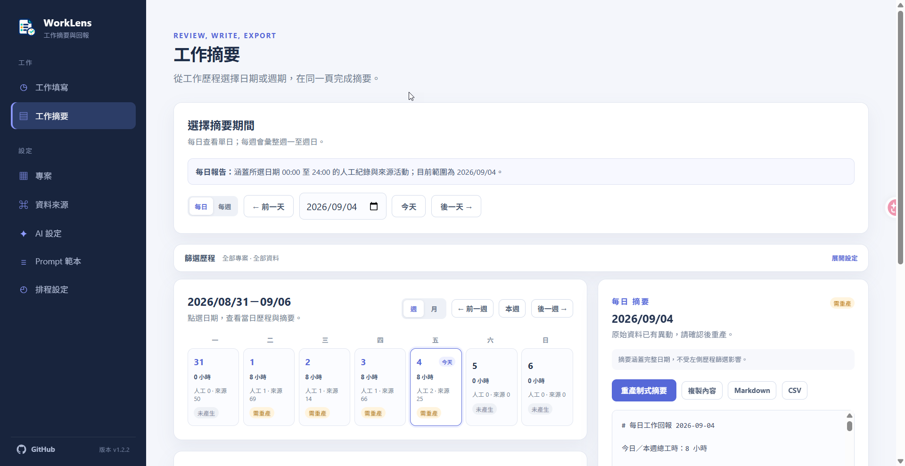
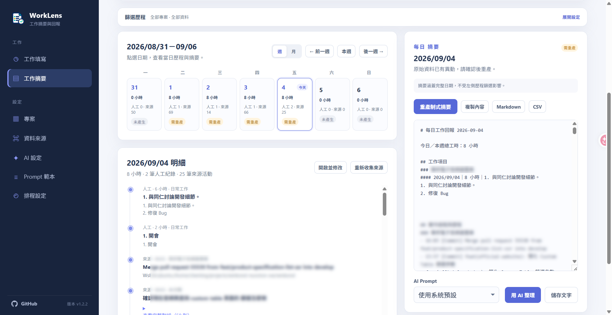
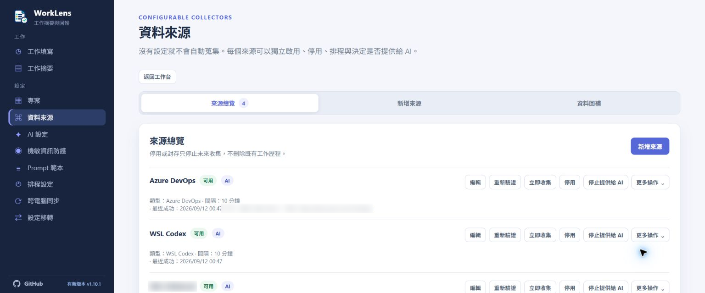
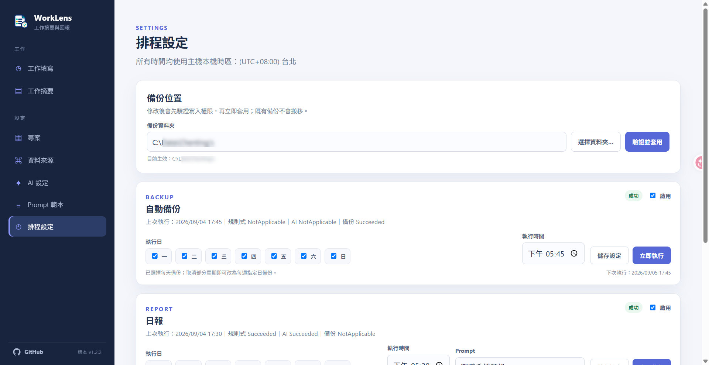

# WorkLens

WorkLens 是一個以本機優先為設計的個人工作歷程與工時回報網站。

## 介面預覽

### 工作填寫



### 工作摘要





### 資料來源



### AI 設定


### Prompt 範本


### 排程設定



## 一鍵安裝

GitHub Release 提供不需預先安裝 .NET 的 self-contained 版本。安裝完成後 WorkLens 會立即在本機啟動、開啟一次瀏覽器、將 `worklens` 指令加入目前使用者的 `PATH`，並設定成目前使用者登入後自動在背景執行。

Windows PowerShell：

```powershell
irm https://raw.githubusercontent.com/wengct/WorkLens/main/scripts/get.ps1 | iex
```

macOS（自動選擇 Apple Silicon 或 Intel 版本）：

```bash
curl -fsSL https://raw.githubusercontent.com/wengct/WorkLens/main/scripts/get.sh | bash
```

安裝器會從公開 GitHub Release 下載套件並核對 `SHA256SUMS`。Windows 程式預設安裝在 `%LOCALAPPDATA%\Programs\WorkLens`，macOS 安裝在 `~/.local/share/worklens`；程式版本與執行資料分開保存。

目前的 Release 未經 Windows code signing 或 Apple notarization。作業系統可能在第一次執行時顯示 SmartScreen 或 Gatekeeper 警告；安裝腳本不會關閉或繞過任何系統安全功能。

Windows 開發環境不會將 leak-hunter 二進位檔提交到 Git。首次需要測試 AI 機敏資訊防護時，請在 repository 根目錄執行：

```powershell
.\scripts\stage-leak-hunter.ps1 -PackageDir (Get-Location).Path -Rid win-x64
```

這會從固定版本的官方 Release 下載並驗證掃描器，放入被 `.gitignore` 忽略的 `tools\leak-hunter`；之後建置會自動將它複製到執行輸出目錄。

### 管理、更新與移除

Windows：

```powershell
worklens status
worklens open
worklens restart
worklens stop
worklens uninstall
```

macOS：

```bash
worklens status
worklens open
worklens restart
worklens stop
worklens uninstall
```

安裝中的終端機可立即使用 `worklens`；其他已開啟的終端機需關閉後重新開啟，才會讀取更新後的 `PATH`。

重新執行一鍵安裝命令即可升級。安裝器會保留上一版；新版無法通過健康檢查時會自動回復。預設解除安裝只移除程式與登入排程，不刪除工作資料；若確定要永久刪除資料，使用 `uninstall --purge-data` 並依提示輸入 `DELETE`。

如需停用登入自動啟動或安裝後不要開啟瀏覽器，可先下載腳本再帶參數：

```powershell
$installer = irm https://raw.githubusercontent.com/wengct/WorkLens/main/scripts/get.ps1
& ([scriptblock]::Create($installer)) -NoAutostart -NoOpenBrowser
```

```bash
curl -fsSL https://raw.githubusercontent.com/wengct/WorkLens/main/scripts/get.sh | bash -s -- --no-autostart --no-open-browser
```

`Git`、Azure CLI、Azure DevOps CLI extension、Node.js、Chrome 與 `ask-bridge` 不會由安裝器自動安裝。它們是資料來源或 AI 功能的選用相依項，WorkLens 會在設定頁個別偵測。

若要使用 Azure DevOps 資料來源，請先安裝 [Azure CLI](https://learn.microsoft.com/en-us/cli/azure/install-azure-cli)，再安裝 Azure DevOps CLI extension：

```shell
az extension add --name azure-devops
az login
```

Windows 也可以使用 `winget install --exact --id Microsoft.AzureCLI` 安裝 Azure CLI；macOS 與 Linux 請依 Microsoft 的平台安裝說明選擇 Homebrew 或套件管理器。WorkLens 只會透過 Azure CLI 讀取 Azure DevOps Services（不支援 Azure DevOps Server），Organization URL 支援 `https://dev.azure.com/<org>` 與 `https://<org>.visualstudio.com`；不會自動安裝 extension、修改 CLI defaults 或啟動互動登入；CLI 必須安裝在 WorkLens 執行的原生主機，不會從 Windows 呼叫 WSL 內的 CLI。

設定來源時，WorkLens 會以 `az ad signed-in-user show` 取得目前登入者的 Entra 身分與 UPN。Entra object ID 與 Azure DevOps 的 IdentityRef ID 是不同識別碼，因此 PR、Work Item 異動與 Discussion 的本人篩選會以 UPN／帳號欄位核對，不會直接比較兩者。

## 隱私與版控邊界

此 repository 僅包含程式碼與安全的預設設定。執行期間的資料會儲存在 repository 外部，預設位置為：

- Windows：`%LOCALAPPDATA%\WorkLens`
- macOS：`~/Library/Application Support/WorkLens`

此目錄包含 SQLite 資料庫、報告、備份、每日實體 log 及本機整合狀態，並已刻意排除在版控之外。請勿將以下內容提交至 Git：

- 工作紀錄、報告、匯出檔案或資料庫檔案；
- Git 作者 email、repository 路徑或私人專案識別資訊；
- AI prompt、回應內容、瀏覽器設定檔、cookie、token 或憑證；
- 本機 `appsettings` 覆寫設定或憑證檔案。

`ask-bridge` 負責管理自己的瀏覽器設定檔與登入狀態。WorkLens 只會呼叫 CLI，不會將 cookie 或憑證複製到 repository。

### AI 傳送前的機敏資訊防護

WorkLens 每次準備把工作資料交給 AI 前，都會在本機掃描最終工作資料與有效 Prompt。發行包目前隨附固定的官方 `leak-hunter v0.5.4` 執行檔，並在建置時以 SHA-256 驗證；使用者不需要另外安裝 `cargo`／`npm` 套件，也不會從系統 PATH 使用其他版本。更新 WorkLens 時會一併更新掃描器，版本檢查失敗會停止 AI 傳送。WorkLens 也會補充 Email 與自訂敏感詞比對。

命中時只修改這一次 AI 請求的記憶體副本，使用 `[已遮蔽：機敏憑證]`、`[已遮蔽：個人資料]` 或 `[已遮蔽：自訂敏感詞]` 取代命中內容。Git、Azure DevOps、人工紀錄與 Prompt 範本的原始資料不會回寫。手動整理會顯示遮蔽後預覽，使用者只能選擇「遮蔽後送出」或「取消」；排程則自動送出已通過第二次掃描的遮蔽副本。掃描器缺失、逾時、結果無法解析、定位不一致或遮蔽後仍有命中時，WorkLens 會停止這次 AI 傳送並保留既有報告。

若需要查看錯誤與啟動紀錄，請檢查：

- Windows：`%LOCALAPPDATA%\WorkLens\logs\worklens-YYYY-MM-DD.log`
- macOS：`~/Library/Application Support/WorkLens/logs/worklens-YYYY-MM-DD.log`

## 執行

```shell
dotnet run
```

開發時可用 `dotnet test tests/WorkLens.Tests/WorkLens.Tests.csproj --configuration Release` 執行回歸測試。另有 `node tests/WorkLens.Tests/work-drafts.cjs` 驗證草稿的瀏覽器操作；需先完成 Release 建置並提供 Playwright（可透過 `NODE_PATH`），預設使用 Edge，其他環境可用 `WORKLENS_TEST_BROWSER` 指定已安裝的 Playwright browser channel。此測試自行啟動獨立連接埠與暫存資料庫，不使用日常工作資料，畫面截圖輸出到忽略版控的 `.test-build/`。

開啟 `http://127.0.0.1:5077`。應用程式只會繫結至 loopback 位址。請從網頁介面設定資料來源與 AI；第一次啟動時不會自動收集任何來源。

## 維護者發行

推送符合 `vX.Y.Z` 的 tag 後，GitHub Actions 會執行測試、安裝煙霧測試，建立 `win-x64`、`osx-x64`、`osx-arm64` 三個 self-contained 套件及 SHA-256 checksum，最後建立公開 Release：

```shell
git tag v1.0.0
git push origin v1.0.0
```

## 日常操作

開啟首頁就是「今日工作台」：可選擇日期、選填專案、輸入時數與 Markdown 工作內容，適合連續補登。Git 來源活動會依日期與專案自動顯示並納入報告，不需要人工關聯。

今日工作台把兩種輸入清楚分開：使用「記工作與工時」記下做了什麼與花費時間；使用「貼上參考資料」補充會議紀錄、需求討論等脈絡。參考資料會保存為來源活動並納入日／週摘要，但不會自行增加確認工時。

新增／編輯工作紀錄與參考資料都會在停止輸入約 1 秒後將草稿存入 WorkLens 本機資料庫。顯示「草稿已暫存」後，即使關閉瀏覽器也能恢復；草稿不會計入工時、提供給 AI 或讓摘要標示為需要重產。頁面的「未完成草稿」可接續其他日期或紀錄，新增表單切換日期時會先暫存原日期內容，再載入新日期的草稿。

編輯視窗可「關閉並保留草稿」，正式儲存後才會清除草稿，也可明確選擇「捨棄草稿」。草稿不自動到期。暫存尚未完成或失敗時，離開會受到保護；請等暫存成功，或先複製內容。若其他分頁更新了同一草稿，或原紀錄已變更／刪除，系統會保留目前輸入並停止覆蓋；先複製要保留的文字，再重新載入最新草稿，必要時捨棄舊編輯草稿後重新開啟原紀錄。

來源收集狀態與當日已匯入活動分開顯示，每 10 秒自動更新，不會重設填寫內容。來源最近成功不代表所選日期已完整收集；當天尚無資料時，可從「查看此日期並重新收集」前往工作摘要執行回補。

「工作摘要」將工作歷程與摘要放在同一頁：可用月曆選擇每日或每週期間、依專案與關鍵字篩選左側歷程，並在右側產生、編輯、AI 整理與匯出完整期間摘要。篩選不會改變摘要涵蓋的資料範圍；回補來源可針對單日或整週執行，且不會改變正常收集的 checkpoint。

資料來源支援 Windows、macOS 與 WSL 的 Git、Codex、Claude Code、GitHub Copilot CLI／App，以及 VS Code Copilot Chat，也支援以 Azure DevOps CLI 讀取 Azure DevOps Services 的 PR 與 Work Item。Azure DevOps 來源可分別收集目前登入使用者建立的 PR，以及該使用者實際修改的 Work Item 欄位與自己撰寫／修改的 Discussion；Work Item 同一天的活動會合併為一筆。Work Item 的完整活動優先於 PR 中的關聯內容，避免 AI 報告重複整理；兩者都沿用同一組報告 AI 設定與機敏資訊防護。Codex 會從 `sessions` 與 `archived_sessions` 讀取本機會話；Claude Code 會從 `projects/<project>/<session-id>.jsonl` 讀取主會話；GitHub Copilot CLI／App 會從 `~/.copilot/session-state/<session-id>/events.jsonl` 讀取會話；三者都排除子代理 transcript、工具內容、思考區塊與附件。VS Code Copilot Chat 會自動探索 Stable／Insiders 的 `workspaceStorage/*/chatSessions`，重建 JSON 快照或 JSONL 操作紀錄；自訂、可攜版與 VS Code Server 位置可在來源設定中填入多個根目錄。這些來源以來源格式、正規化資料根目錄、session id 去重；VS Code 另外區分 workspace，保存 User／AI 可見文字對話；每日、每週及 AI 報告上下文只使用 User 訊息。GitHub Copilot 整合不收集 Token、費用或用量統計。Codex 資料目錄可自動偵測 `CODEX_HOME`／`~/.codex`；Claude Code 可自動偵測 `CLAUDE_CONFIG_DIR`／`~/.claude`；Copilot CLI／App 可自動偵測 `COPILOT_HOME`／`~/.copilot`；這些路徑都可在來源設定中覆寫。

Visual Studio Copilot Chat 已支援 Visual Studio 2026 Chat 與 Agent（Preview）。非空 session 是 MessagePack 二進位串流，包含 `TimeCreated`、`TimeUpdated` 與巢狀訊息內容；同一個 Session GUID 的 before／after 樣本已確認檔案會持續更新，Agent（Preview）則以 `CopilotCliResponder` 辨識。日期會以 session 的建立／更新欄位為準，沒有逐則訊息時間時不會自行推算細分時間。

VS Code Copilot Chat 的自動探索位置如下；只會檢查這些 `workspaceStorage` 根目錄，不會掃描整台電腦：

- Windows Stable：`%APPDATA%\Code\User\workspaceStorage`
- Windows Insiders：`%APPDATA%\Code - Insiders\User\workspaceStorage`
- macOS Stable：`~/Library/Application Support/Code/User/workspaceStorage`
- macOS Insiders：`~/Library/Application Support/Code - Insiders/User/workspaceStorage`
- WSL Stable：`${XDG_CONFIG_HOME:-$HOME/.config}/Code/User/workspaceStorage`
- WSL Insiders：`${XDG_CONFIG_HOME:-$HOME/.config}/Code - Insiders/User/workspaceStorage`

每個 workspace 目錄下的 `chatSessions` 會被讀取；自訂、可攜版與 VS Code Server 位置請在來源設定填入多個根目錄。Visual Studio 2026 來源則以方案目錄為單位搜尋 `<方案目錄>/.vs/<方案名稱>/copilot-chat/<識別碼>/sessions/`，不需要使用者填入內部識別碼目錄。

各用戶端的實際格式驗證與 Visual Studio 關卡狀態記錄於 [`docs/copilot-format-validation.md`](docs/copilot-format-validation.md)。

摘要可直接用 AI 產生；若尚無摘要，系統先建立基本摘要作為 AI 整理的起點。AI 未設定時會說明原因，基本摘要仍可使用。每份日／週摘要會保存一份上一版，可在摘要頁還原，還原後也能再次還原來撤回操作。切換期間、AI 整理、複製或下載前會先保存畫面的修改；其他分頁或排程已更新時，系統會停止覆蓋並要求重新載入。AI 整理可從「整理方式」選擇範本，系統仍固定驗證 JSON、工時與工作紀錄 ID。

第一次使用時，工作台會自動開啟「建立第一份工作摘要」視窗：記一筆工作，或設定資料來源並自行完成首次收集，最後產生第一份摘要。AI 設定是選用步驟；之後可從「記工作與工時」右上角的同名按鈕重新開啟。

「排程設定」可分別管理日報、週報、每日備份與每週備份的啟用狀態、星期及時間。報告排程會先保留制式摘要，再使用指定或預設 Prompt 執行 AI 整理；AI 失敗時不會丟失制式內容。備份位置可從網頁選擇並驗證，變更後立即生效。
